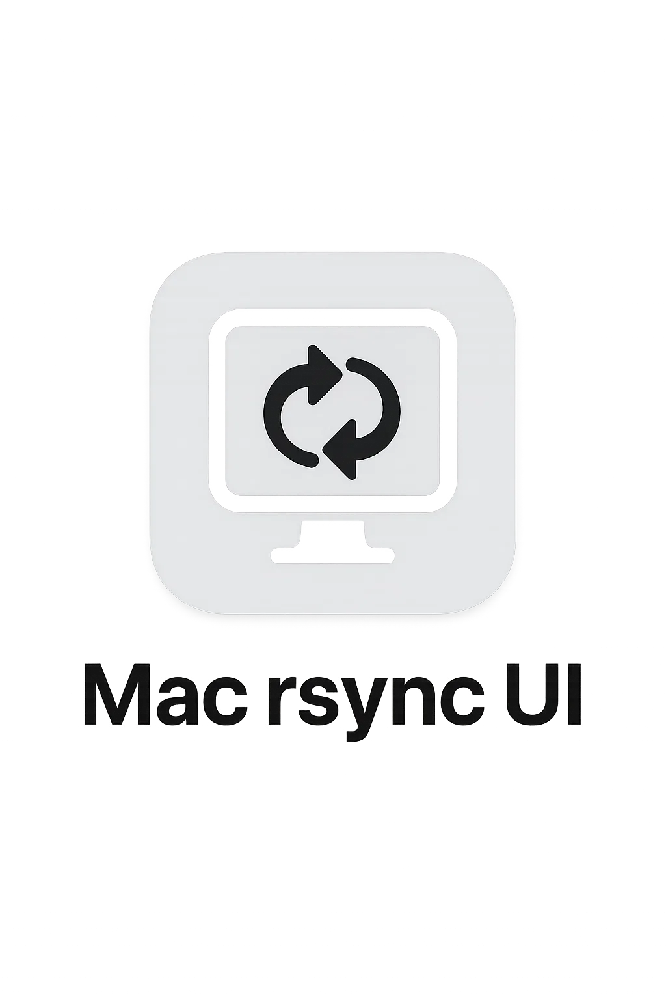

# Mac Rsync UI

A Mac application for syncing files from local folders (like SD cards) to Synology NAS with resume capability.

## Features

- **Resume Support**: Uses rsync's `--partial` flag to resume interrupted transfers
- **Copy or Move**: Choose between copying files or moving them (removing source files)
- **Progress Tracking**: Real-time progress display with detailed logging
- **Configuration Persistence**: Saves your source/target folder preferences
- **Native Mac App**: Built with Electron for a native Mac experience

## Prerequisites

- macOS
- Node.js (v16 or later)
- rsync (pre-installed on macOS)

## Installation

1. Clone or download this repository
2. Install dependencies:
   ```bash
   npm install
   ```

## Usage

1. **Development Mode**:
   ```bash
   npm run dev
   ```

2. **Production Mode**:
   ```bash
   npm start
   ```

3. **Build App**:
   ```bash
   npm run build
   ```

## How to Use

1. **Select Source Folder**: Click "Browse" next to Source Folder to select your SD card or local folder
2. **Select Target Folder**: Click "Browse" next to Target Folder to select your Synology NAS folder
3. **Choose Operation**: Select either "Copy Files" or "Move Files"
4. **Start Sync**: Click "Start Sync" to begin the operation
5. **Monitor Progress**: Watch the progress log for real-time updates
6. **Resume Capability**: If the sync is interrupted, simply restart it - rsync will resume from where it left off

## Resume Functionality

The app uses rsync's `--partial` flag which:
- Keeps partially transferred files when interrupted
- Resumes from the exact byte where transfer stopped
- Works even if the connection to your Synology NAS is lost
- Automatically detects and continues incomplete transfers

## Configuration

The app automatically saves your folder selections and operation preferences. This configuration is stored in your user data directory and will be restored when you restart the app.

## Troubleshooting

- **Permission Issues**: Make sure you have read access to the source folder and write access to the target folder
- **Network Issues**: The app will show connection errors in the progress log. Simply restart the sync when your network connection is restored
- **Rsync Not Found**: rsync is pre-installed on macOS, but if you encounter issues, you can install it via Homebrew: `brew install rsync`

## Technical Details

- Built with Electron for cross-platform compatibility
- Uses Node.js child_process to execute rsync commands
- Implements real-time progress monitoring through stdout/stderr parsing
- Stores configuration in JSON format in the user's application data directory
